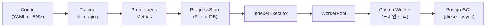

# Sui 서비스 특화 인덱서 코드 분석

이 문서는 Mysten Labs의 **DeepBook Indexer**, **Suins Indexer**, 그리고 **Indexer Builder** 크레이트의 핵심 모듈과 함수들을 살펴보며, 서비스용 커스텀 인덱서가 어떻게 동작하는지 코드 레벨에서 이해하는 데 목적을 둡니다.
각 컴포넌트가 어떻게 상호작용하며, 어떤 책임을 갖고 있는지 실제 소스코드를 통해 단계별로 탐구합니다.

---

# Sui 서비스 특화 인덱서 설계: Why & How

## Quickstart: 7단계로 커스텀 인덱서 만들기
1. 새 바이너리 크레이트 생성
```bash
cargo new --bin my-indexer
cd my-indexer
```
2. `Cargo.toml`에 공통 의존성 추가
```toml
[dependencies]
async-trait = "0.1"
tokio = { version = "1", features = ["full"] }
diesel_async = { version = "2", features = ["postgres"] }
serde = { version = "1", features = ["derive"] }
serde_yaml = "0.9"
telemetry-subscribers = { workspace = true }
mysten-metrics = { workspace = true }
sui-data-ingestion-core = { workspace = true }
sui-pg-db = { workspace = true }
```
3. `src/config.rs` 작성
```rust
use serde::{Deserialize, Serialize};
use std::env;

// 인덱서 설정 구조체 (YAML 파일에서 자동 파싱)
#[derive(Debug, Deserialize, Serialize)]
pub struct IndexerConfig {
    pub db_url: String,           // PostgreSQL 연결 문자열
    pub remote_store_url: String, // 체크포인트 원격 저장소 URL
    
    // YAML에 없으면 default_concurrency() 함수 호출
    #[serde(default = "default_concurrency")] 
    pub concurrency: usize,       // 동시 처리 체크포인트 수
}

// sui_config::Config 트레이트 구현으로 Config::load() 사용 가능
impl sui_config::Config for IndexerConfig {}

// 기본 동시성 값 제공 함수
fn default_concurrency() -> usize { 10 }
```
4. `src/main.rs` 작성
```rust
mod config; mod processor;
use telemetry_subscribers::TelemetryConfig;
use mysten_metrics::start_prometheus_server;
use sui_data_ingestion_core::{setup_single_workflow, ReaderOptions};
use sui_config::Config;

#[tokio::main]
async fn main() -> anyhow::Result<()> {
  // 로깅 및 트레이싱 초기화 (RUST_LOG 환경변수 읽기)
  TelemetryConfig::new().with_env().init();
  
  // YAML 설정 파일 로드
  let cfg = IndexerConfig::load("config.yaml")?;
  
  // Prometheus 메트릭 서버 시작 (9090 포트)
  let registry = start_prometheus_server("0.0.0.0:9090".parse()?).default_registry();
  
  // 단일 워커 파이프라인 설정
  let (exec, stop) = setup_single_workflow(
    processor::MyProcessor::new(&cfg).await?, // 커스텀 워커 생성
    cfg.remote_store_url.clone(),             // 원격 체크포인트 저장소
    0,                                        // 시작 체크포인트 (0부터)
    cfg.concurrency,                          // 동시 처리 수
    Some(ReaderOptions{batch_size:100,..Default::default()}), // 읽기 옵션
  ).await?;
  
  // 인덱서 실행 (무한 루프로 체크포인트 처리)
  exec.await?; 
  Ok(())
}
```
5. `src/processor.rs` 작성
```rust
use async_trait::async_trait;
use sui_data_ingestion_core::Worker;
use sui_types::full_checkpoint_content::CheckpointData;

// 커스텀 워커 구조체 (도메인별 비즈니스 로직 담당)
pub struct MyProcessor;

impl MyProcessor {
    pub async fn new(config: &IndexerConfig) -> anyhow::Result<Self> {
        // DB 연결 풀 생성, 메트릭 초기화 등
        Ok(Self)
    }
}

#[async_trait]
impl Worker for MyProcessor {
  type Result = (); // 처리 결과 타입
  
  // 각 체크포인트를 받아서 처리하는 핵심 메서드
  async fn process_checkpoint(&self, cp: &CheckpointData) -> anyhow::Result<()> {
    // 1. 체크포인트에서 관심있는 트랜잭션 필터링
    // 2. 트랜잭션에서 특정 이벤트 추출
    // 3. 이벤트를 도메인 객체로 변환
    // 4. 데이터베이스에 저장
    // 도메인 로직
    Ok(())
  }
}
```
6. Diesel 마이그레이션 생성 및 실행
```bash
diesel setup --database-url "$DB_URL"
diesel migration generate create_my_table
diesel migration run
diesel migration reset
diesel setup
diesel migration run
```
7. 실행 및 검증
```bash
cargo run --bin my-indexer
```   

---



이 글에서는 Mysten Labs가 Sui 생태계에서 운영 중인 **DeepBook Indexer**, **Suins Indexer**, 그리고 **Indexer Builder** 크레이트를 참고해, 서비스 특화 인덱서를 어떻게 설계하고 왜 이렇게 구성했는지 단계별로 살펴보겠습니다.

---

## 1. 배경 및 요구사항

1. 체인 데이터 스케일: Sui 네트워크의 트랜잭션·체크포인트 볼륨을 안정적으로 처리해야 합니다.
2. 실시간 스트리밍 & 백필: 과거 데이터(backfill)와 신규 이벤트(live) 모두 지원.
3. 확장성: 도메인별 비즈니스 로직 분리, 테스트·배포 편의.
4. 관찰성: 메트릭·로그·진척도를 통한 운영 모니터링.
5. 일관된 마이그레이션: 스키마 변경 시 자동화.

이 모든 요구를 만족하기 위해 **공통 인프라** 위에 **도메인별 워커**를 주입하는 구조를 선택했습니다.

---

## 2. 설계 원칙

- **단일 책임 원칙 (SRP)**: 설정, 로깅, 메트릭, 진척도, 인제스트, 처리, 저장을 개별 모듈로 분리
- **추상화 & 재사용**: `Worker`, `Datasource`, `Persistent` 트레이트로 재사용성 확보
- **비동기 파이프라인**: Tokio 기반 채널·스레드풀로 확장성 확보
- **Idempotency**: ProgressStore를 통한 체크포인트 매핑으로 재시작 가능
- **관찰성**: `telemetry-subscribers`, `prometheus` 통합으로 지표 수집

---

## 3. 공통 컴포넌트

### 3.1 Config 로드
serde_yaml + sui_config::Config 트레이트로 YAML 파일 혹은 ENV 로드 지원
+[GitHub 예제](https://github.com/MystenLabs/sui/blob/main/crates/sui-deepbook-indexer/src/config.rs#L1-L12)

```rust
use serde::{Deserialize, Serialize};
use std::env;

// serde를 사용해 YAML/JSON 파일에서 설정을 자동으로 파싱할 수 있도록 derive 매크로 적용
#[derive(Debug, Clone, Deserialize, Serialize)]
pub struct IndexerConfig {
    // 원격 체크포인트 저장소 URL (AWS S3, GCS 등)
    pub remote_store_url: String,
    
    // DB 연결 문자열. YAML에 없으면 default_db_url 함수 호출
    #[serde(default = "default_db_url")] 
    pub db_url: String,
    // ... 기타 필드 생략
}

// sui_config::Config 트레이트 구현으로 Config::load() 메서드 사용 가능
impl sui_config::Config for IndexerConfig {}

// YAML에 db_url이 없을 때 환경변수에서 가져오는 fallback 함수
fn default_db_url() -> String {
    env::var("DB_URL").expect("DB_URL must be set")
}
```
### 3.2 트레이싱 & 로깅
telemetry-subscribers를 사용해 로깅 레이어 초기화
+[GitHub 예제](https://github.com/MystenLabs/sui/blob/main/crates/sui-deepbook-indexer/src/main.rs#L5-L10)

```rust
use telemetry_subscribers::TelemetryConfig;

// 텔레메트리 설정 객체 생성
let telemetry = TelemetryConfig::new()
    // RUST_LOG 환경변수를 읽어서 로그 레벨 필터링 (debug, info, warn, error)
    .with_env_filter()   
    // OpenTelemetry OTLP exporter 활성화 (Jaeger, DataDog 등으로 전송 가능)
    .with_opentelemetry()
    // 전역 tracing subscriber 등록 (이후 tracing::info! 매크로 사용 가능)
    .init();

// 초기화 완료 로그 출력
tracing::info!("Telemetry initialized");
```
### 3.3 Metrics 서버
mysten_metrics::start_prometheus_server로 Prometheus metrics 서버 기동
+[GitHub 예제](https://github.com/MystenLabs/sui/blob/main/crates/sui-deepbook-indexer/src/main.rs#L12-L16)

```rust
use mysten_metrics::start_prometheus_server;

// 0.0.0.0:port 형태의 소켓 주소 생성 (모든 인터페이스에서 접근 가능)
let metrics_address =
    SocketAddr::new(IpAddr::V4(Ipv4Addr::new(0, 0, 0, 0)), config.metric_port);

// HTTP 서버 시작하여 /metrics 엔드포인트에서 Prometheus 형식 메트릭 제공
let registry_service = start_prometheus_server(metrics_address);

// 메트릭 등록을 위한 레지스트리 객체 가져오기
let registry = registry_service.default_registry();

// 기본 시스템 메트릭들(CPU, 메모리, 네트워크 등)을 레지스트리에 등록
mysten_metrics::init_metrics(&registry);

tracing::info!("Metrics server started at port {}", config.metric_port);
```
### 3.4 ProgressStore
FileProgressStore로 로컬 파일 기반 진척도 저장
+[GitHub 예제](https://github.com/MystenLabs/sui/blob/main/crates/sui-data-ingestion-core/src/progress_store.rs#L1-L20)

```rust
use sui_data_ingestion_core::FileProgressStore;

// 인덱서가 어느 체크포인트까지 처리했는지 JSON 파일로 저장하는 객체 생성
// 재시작 시 이 파일을 읽어서 중단된 지점부터 다시 시작할 수 있음
let progress_store = FileProgressStore::new(PathBuf::from(config.progress_file_path));
```
### 3.5 Ingestion Core
setup_single_workflow으로 체크포인트 파이프라인 구성
+[GitHub 예제](https://github.com/MystenLabs/sui/blob/main/crates/sui-data-ingestion-core/src/executor.rs#L56-L73)

```rust
// 단일 워커로 체크포인트 처리 파이프라인을 설정하는 함수
// W: Worker 트레이트를 구현한 커스텀 처리 로직
pub async fn setup_single_workflow<W: Worker + 'static>(
    // 진척도 저장소 (파일 또는 DB 기반)
    progress_store: impl ProgressStore + Clone,
    // 동시 처리할 체크포인트 수 (메모리 사용량과 처리 속도의 트레이드오프)
    concurrency: usize,
    // 처리 성능 메트릭 수집기
    metrics: DataIngestionMetrics,
) -> Result<(), anyhow::Error> {
    // IndexerExecutor 생성 및 WorkerPool 등록 로직
    // ...
}
```
### 3.6 도메인 워커
async_trait 기반 도메인 워커 구현
+[GitHub 예제](https://github.com/MystenLabs/sui/blob/main/crates/suins-indexer/src/main.rs#L43-L66)

```rust
// async 트레이트 메서드를 위한 매크로 (Rust는 기본적으로 async trait 지원 안함)
#[async_trait]
impl Worker for SuinsIndexerWorker {
    // 처리 결과 타입 (보통 () 또는 커스텀 결과 타입)
    type Result = ();
    
    // 각 체크포인트를 받아서 도메인별 비즈니스 로직 수행
    async fn process_checkpoint(&self, checkpoint: &CheckpointData) -> Result<()> {
        // 1. 체크포인트에서 관심있는 트랜잭션/이벤트 필터링
        // 2. 도메인 객체로 변환 (예: SuiNS 도메인 등록/갱신 이벤트)
        // 3. 데이터베이스에 저장
        // 도메인 로직
        Ok(())
    }
}
```
### 3.7 Persistence
diesel_async를 사용한 PostgreSQL 연결 풀 관리
+[GitHub 예제](https://github.com/MystenLabs/sui/blob/main/crates/sui-deepbook-indexer/src/postgres_manager.rs#L1-L18)

```rust
use diesel_async::pooled_connection::bb8::{Pool, AsyncDieselConnectionManager};

// PostgreSQL 연결 풀을 생성하는 함수
// 연결 풀을 사용하면 매번 새 연결을 만들지 않고 기존 연결을 재사용해서 성능 향상
pub fn get_connection_pool(db_url: String) -> Pool<AsyncDieselConnectionManager<AsyncPgConnection>> {
    // bb8 풀 매니저로 비동기 Diesel 연결 관리
    // 최대 연결 수, 타임아웃, 재시도 정책 등을 설정할 수 있음
    // ...
}
```

---

## 4. 서비스별 특화 예시

### 4.1 DeepBook Indexer
IndexerBuilder를 사용해 백필 및 실시간 파이프라인 구성
+[GitHub 예제](https://github.com/MystenLabs/sui/blob/main/crates/sui-deepbook-indexer/src/main.rs#L91-L101)

```rust
// IndexerBuilder 패턴으로 인덱서 구성
let indexer = IndexerBuilder::new(
    // 인덱서 이름 (로그, 메트릭에서 식별용)
    "SuiDeepBookIndexer",
    // 체크포인트 데이터 소스 (원격 저장소에서 체크포인트 읽기)
    sui_checkpoint_datasource,
    // 원시 체크포인트 데이터를 DeepBook 도메인 객체로 변환하는 매퍼
    SuiDeepBookDataMapper { /* ... */ },
    // 변환된 데이터를 PostgreSQL에 저장하는 영속화 계층
    datastore,
)
.build(); // 빌더 패턴으로 인덱서 객체 생성

// 인덱서 시작 (백필 태스크 + 실시간 태스크 모두 실행)
indexer.start().await?;
```
### 4.2 Suins Indexer
IndexerExecutor와 WorkerPool을 통한 Suins 인덱싱
[GitHub 예제](https://github.com/MystenLabs/sui/blob/main/crates/suins-indexer/src/main.rs#L158-L166)

```rust
// IndexerExecutor 생성 (체크포인트 읽기 및 워커 풀 관리)
let mut executor = IndexerExecutor::new(
    progress_store, // 진척도 저장소
    1,              // 워커 풀 개수 (보통 1개, 복잡한 경우 여러 개)
    metrics         // 성능 메트릭 수집기
);

// SuiNS 도메인 로직을 처리하는 워커 풀 생성
let worker_pool = WorkerPool::new(
    SuinsIndexerWorker { /* ... */ }, // 실제 비즈니스 로직을 담은 워커
    "suins_indexing".to_string(),     // 워커 풀 이름 (로그/메트릭용)
    100,                              // 동시 처리할 체크포인트 수
);

// 워커 풀을 executor에 등록
executor.register(worker_pool).await?;

// 인덱서 실행 시작
executor.run(
    PathBuf::from(checkpoints_dir), // 로컬 체크포인트 캐시 디렉토리
    remote_storage,                 // 원격 체크포인트 저장소 URL
    vec![],                         // 추가 원격 저장소 옵션
    ReaderOptions::default(),       // 체크포인트 읽기 옵션 (배치 크기 등)
    exit_receiver,                  // Graceful shutdown을 위한 시그널 수신기
).await?;
```
### 4.3 Indexer Builder 크레이트
제네릭 Datasource, DataMapper, Persistent 인터페이스 제공
+[GitHub 예제](https://github.com/MystenLabs/sui/blob/main/crates/sui-indexer-builder/src/indexer_builder.rs#L10-L17)

```rust
pub struct IndexerBuilder<D, M, P> { ... }
impl<D, M, P> IndexerBuilder<D, M, P> { pub fn new<R>(...) } // 생략
```

---

## 5. 내부 구조 심층 분석

### 5.1 IndexerBuilder 흐름
IndexerBuilder를 통해 태스크가 등록·갱신되고, 백필과 실시간 파이프라인이 기동되는 전 과정을 살펴봅니다.
+[GitHub 예제](https://github.com/MystenLabs/sui/blob/main/crates/sui-indexer-builder/src/indexer_builder.rs#L22-L41)

```rust
impl<P, D, M> Indexer<P, D, M> {
    // 인덱서 시작 메서드 (제네릭 타입으로 다양한 구현체 지원)
    pub async fn start<T, R>(mut self) -> Result<(), Error>
    where
        D: Datasource<T> + 'static,  // 데이터 소스 (체크포인트 읽기)
        M: DataMapper<T, R> + 'static, // 데이터 변환기 (원시 → 도메인 객체)
        P: Persistent<R> + 'static,   // 영속화 계층 (DB 저장)
        T: Send,                      // 스레드 간 전송 가능한 타입
    {
        // 1. 기존 태스크 상태 확인 및 새 태스크 등록
        // DB에서 진행 중인 태스크들을 조회하고 필요시 새 태스크 생성
        self.update_tasks().await?;
        
        // 2. 실시간 태스크 시작 (최신 체크포인트부터 계속 처리)
        // target_checkpoint가 i64::MAX인 태스크를 찾아서 실행
        if let Some(live) = ongoing.live_task() {
            self.datasource
                .start_ingestion_task(live, self.storage.clone(), self.data_mapper.clone())
                .await?;
        }
        
        // 3. 백필 태스크들을 역순으로 실행 (최신 → 과거 순서)
        // 아직 완료되지 않은 백필 태스크들을 순차적으로 처리
        for task in ongoing.backfill_tasks_ordered_desc() {
            if task.start_checkpoint < task.target_checkpoint {
                self.datasource
                    .start_ingestion_task(task, ...)
                    .await?;
            }
        }
        Ok(())
    }
}
```

### 5.2 DataMapper & Persistent 인터페이스
도메인별 매핑과 영속화 로직이 분리된 구조를 확인합니다.

#### DataMapper 트레이트 정의
+[GitHub 예제](https://github.com/MystenLabs/sui/blob/main/crates/sui-indexer-builder/src/indexer_builder.rs#L561-L569)
```rust
// 원시 데이터를 도메인 객체로 변환하는 트레이트
// T: 입력 타입 (보통 CheckpointTxnData), R: 출력 타입 (도메인 객체)
pub trait DataMapper<T, R>: Sync + Send + Clone {
    // 하나의 입력을 여러 개의 출력으로 변환 (1:N 매핑)
    // 예: 하나의 트랜잭션에서 여러 개의 이벤트가 나올 수 있음
    fn map(&self, data: T) -> Result<Vec<R>, anyhow::Error>;
}
```

#### DeepBook DataMapper 구현 예시
+[GitHub 예제](https://github.com/MystenLabs/sui/blob/main/crates/sui-deepbook-indexer/src/sui_deepbook_indexer.rs#L363-L372)
```rust
// DeepBook 전용 데이터 매퍼 구조체
#[derive(Clone)]
pub struct SuiDeepBookDataMapper { 
    metrics: DeepBookIndexerMetrics, // 성능 메트릭 수집기
    package_id: ObjectID             // DeepBook 패키지 ID (이벤트 필터링용)
}

// CheckpointTxnData를 ProcessedTxnData로 변환하는 구현
impl DataMapper<CheckpointTxnData, ProcessedTxnData> for SuiDeepBookDataMapper {
    fn map(&self, (data, cp, ts): CheckpointTxnData) -> Result<Vec<ProcessedTxnData>, Error> {
        // 1. 트랜잭션에서 DeepBook 관련 이벤트만 필터링
        // 2. 이벤트 타입별로 분류 (주문 생성, 체결, 취소 등)
        // 3. 각 이벤트를 DB 저장용 구조체로 변환
        // 4. 메트릭 업데이트 (처리된 이벤트 수 등)
        // 이벤트 필터링 → DB 타입 매핑 로직
    }
}
```

#### Persistent 트레이트 정의 및 구현
+[GitHub 예제](https://github.com/MystenLabs/sui/blob/main/crates/sui-indexer-builder/src/indexer_builder.rs#L322-L330)
```rust
// 데이터 영속화를 담당하는 트레이트
// IndexerProgressStore도 함께 구현해야 함 (진척도 저장 기능)
pub trait Persistent<T>: IndexerProgressStore + Sync + Send + Clone {
    // 변환된 데이터 배치를 DB에 저장
    async fn write(&self, data: Vec<T>) -> Result<(), Error>;
}
```

+[GitHub 예제](https://github.com/MystenLabs/sui/blob/main/crates/sui-deepbook-indexer/src/sui_deepbook_indexer.rs#L14-L22)
```rust
// PostgreSQL 기반 DeepBook 데이터 영속화 구조체
#[derive(Clone)]
pub struct PgDeepbookPersistent { 
    pool: PgPool,                           // 데이터베이스 연결 풀
    save_progress_policy: ProgressSavingPolicy // 진척도 저장 정책 (즉시/배치/시간 기반)
}

#[async_trait]
impl Persistent<ProcessedTxnData> for PgDeepbookPersistent {
    async fn write(&self, data: Vec<ProcessedTxnData>) -> Result<(), Error> {
        // 1. 데이터 타입별로 배치 분리 (주문, 체결, 잔액 등)
        // 2. 각 배치를 별도 테이블에 INSERT
        // 3. 트랜잭션으로 원자성 보장 (전체 성공 또는 전체 실패)
        // 4. 진척도 업데이트 (어느 체크포인트까지 처리했는지)
        // 배치 분리 및 diesel 트랜잭션으로 일괄 쓰기
    }
}
```

### 5.3 ProgressStore 구현
진척도 저장소의 추상화와 파일 기반 구현을 살펴봅니다.

#### ProgressStore 트레이트 정의
+[GitHub 예제](https://github.com/MystenLabs/sui/blob/main/crates/sui-data-ingestion-core/src/progress_store/mod.rs#L6-L13)
```rust
// 인덱서 진척도 저장/로드를 위한 트레이트
#[async_trait]
pub trait ProgressStore: Send {
    // 특정 태스크가 마지막으로 처리한 체크포인트 번호 로드
    async fn load(&mut self, task_name: String) -> Result<u64>;
    
    // 특정 태스크의 현재 체크포인트 번호 저장
    // 인덱서 재시작 시 이 지점부터 다시 시작
    async fn save(&mut self, task_name: String, checkpoint: u64) -> Result<()>;
}
```

#### FileProgressStore 구현
+[GitHub 예제](https://github.com/MystenLabs/sui/blob/main/crates/sui-data-ingestion-core/src/progress_store/file.rs#L1-L46)
```rust
// 파일 기반 진척도 저장소 구조체
pub struct FileProgressStore { 
    path: PathBuf // JSON 파일 경로
}

#[async_trait]
impl ProgressStore for FileProgressStore {
    // JSON 파일에서 태스크별 진척도 로드
    async fn load(&mut self, name: String) -> Result<u64> { 
        // 1. JSON 파일 읽기
        // 2. task_name을 키로 체크포인트 번호 조회
        // 3. 없으면 0 반환 (처음 시작)
        /* JSON 읽기 */ 
    }
    
    // JSON 파일에 태스크별 진척도 저장
    async fn save(&mut self, name: String, cp: u64) -> Result<()> { 
        // 1. 기존 JSON 파일 읽기 (없으면 빈 객체)
        // 2. task_name 키에 새 체크포인트 번호 업데이트
        // 3. JSON 파일에 다시 쓰기 (원자적 쓰기)
        /* JSON 쓰기 */ 
    }
}
```

---

## 6. 결론

위 패턴은 다음을 보장합니다:

1. **확장성**: 새로운 도메인 로직을 `Worker`로 간단 주입
2. **재사용성**: 공통 인프라(CLI·Logging·Metrics·Ingest) 분리
3. **운영 안정성**: ProgressStore·메트릭·Graceful Shutdown

Sui 서비스 특화 인덱서를 구축할 때, 이 구조를 그대로 재사용하면 빠르고 견고한 파이프라인을 만들 수 있습니다.

---

## 7. DeepBook Indexer 파일별 분석
Sui DeepBook Indexer 크레이트의 주요 파일과 역할을 살펴봅니다.

### 7.1 config.rs
설정 로딩: YAML 혹은 ENV를 통해 인덱서 설정을 정의하고 `Config::load`로 파싱합니다.
[GitHub](https://github.com/MystenLabs/sui/blob/main/crates/sui-deepbook-indexer/src/config.rs)

### 7.2 error.rs
에러 타입 정의: 내부 오류를 표현하는 단순한 `DeepBookError` 열거형입니다.
[GitHub](https://github.com/MystenLabs/sui/blob/main/crates/sui-deepbook-indexer/src/error.rs)

### 7.3 lib.rs
모듈 공개: 크레이트의 엔트리 포인트로, 주요 하위 모듈(`config`, `error`, `events` 등)을 선언합니다.
[GitHub](https://github.com/MystenLabs/sui/blob/main/crates/sui-deepbook-indexer/src/lib.rs)

### 7.4 events.rs
Move 이벤트 타입 정의: 체결·취소·만료 등 DeepBook 관련 이벤트 구조체를 선언합니다.
[GitHub](https://github.com/MystenLabs/sui/blob/main/crates/sui-deepbook-indexer/src/events.rs)

### 7.5 main.rs
진입점: 설정 로드, 트레이싱·메트릭 초기화, HTTP 서버 기동, 데이터 파이프라인 실행을 담당합니다.
[GitHub](https://github.com/MystenLabs/sui/blob/main/crates/sui-deepbook-indexer/src/main.rs)

### 7.6 metrics.rs
지표 정의: Prometheus 레지스트리에 등록할 카운터·게이지를 선언하고 `IndexerMetricProvider`를 구현합니다.
[GitHub](https://github.com/MystenLabs/sui/blob/main/crates/sui-deepbook-indexer/src/metrics.rs)

### 7.7 models.rs
데이터베이스 모델: Diesel ORM을 위한 `Queryable`·`Insertable` 구조체와 `Task` 변환 로직을 포함합니다.
[GitHub](https://github.com/MystenLabs/sui/blob/main/crates/sui-deepbook-indexer/src/models.rs)

### 7.8 postgres_manager.rs
DB 연결 풀: `AsyncDieselConnectionManager` 기반의 Postgres 풀 생성 함수를 제공합니다.
[GitHub](https://github.com/MystenLabs/sui/blob/main/crates/sui-deepbook-indexer/src/postgres_manager.rs)

### 7.9 schema.rs
Diesel 스키마: 자동 생성된 테이블 스키마 정의로, ORM 매핑에 사용됩니다.
[GitHub](https://github.com/MystenLabs/sui/blob/main/crates/sui-deepbook-indexer/src/schema.rs)

### 7.10 server.rs
HTTP 서버 구현: Axum 기반 REST 엔드포인트 정의 및 라우터 생성 로직을 포함합니다.
[GitHub](https://github.com/MystenLabs/sui/blob/main/crates/sui-deepbook-indexer/src/server.rs)

### 7.11 sui_deepbook_indexer.rs
인덱서 코어: `DataMapper`, `Persistent` 인터페이스 사용, 이벤트 처리→DB 매핑 파이프라인을 구현합니다.
[GitHub](https://github.com/MystenLabs/sui/blob/main/crates/sui-deepbook-indexer/src/sui_deepbook_indexer.rs)

### 7.12 types.rs
도메인 타입: 체크포인트 원시 데이터와 매핑된 `ProcessedTxnData` 열거형 및 변환 헬퍼를 정의합니다.
[GitHub](https://github.com/MystenLabs/sui/blob/main/crates/sui-deepbook-indexer/src/types.rs)

---

## 8. 결론

위 패턴은 다음을 보장합니다:

1. **확장성**: 새로운 도메인 로직을 `Worker`로 간단 주입
2. **재사용성**: 공통 인프라(CLI·Logging·Metrics·Ingest) 분리
3. **운영 안정성**: ProgressStore·메트릭·Graceful Shutdown

Sui 서비스 특화 인덱서를 구축할 때, 이 구조를 그대로 재사용하면 빠르고 견고한 파이프라인을 만들 수 있습니다.
