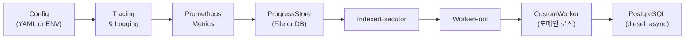

# Sui 서비스 특화 인덱서 코드 분석

이 문서는 Mysten Labs의 **DeepBook Indexer**, **Suins Indexer**, 그리고 **Indexer Builder** 크레이트의 핵심 모듈과 함수들을 살펴보며, 서비스용 커스텀 인덱서가 어떻게 동작하는지 코드 레벨에서 이해하는 데 목적을 둡니다.
각 컴포넌트가 어떻게 상호작용하며, 어떤 책임을 갖고 있는지 실제 소스코드를 통해 단계별로 탐구합니다.

---

# Sui 서비스 특화 인덱서 설계: Why & How

## Quickstart: 7단계로 커스텀 인덱서 만들기
1. 새 바이너리 크레이트 생성
```bash
cargo new --bin my-indexer
cd my-indexer
```
2. `Cargo.toml`에 공통 의존성 추가
```toml
[dependencies]
async-trait = "0.1"
tokio = { version = "1", features = ["full"] }
diesel_async = { version = "2", features = ["postgres"] }
serde = { version = "1", features = ["derive"] }
serde_yaml = "0.9"
telemetry-subscribers = { workspace = true }
mysten-metrics = { workspace = true }
sui-data-ingestion-core = { workspace = true }
sui-pg-db = { workspace = true }
```
3. `src/config.rs` 작성
```rust
use serde::{Deserialize, Serialize};
use std::env;
#[derive(Debug, Deserialize, Serialize)]
pub struct IndexerConfig {
    pub db_url: String,
    pub remote_store_url: String,
    #[serde(default = "default_concurrency")] pub concurrency: usize,
}
impl sui_config::Config for IndexerConfig {}
```
4. `src/main.rs` 작성
```rust
mod config; mod processor;
use telemetry_subscribers::TelemetryConfig;
use mysten_metrics::start_prometheus_server;
use sui_data_ingestion_core::{setup_single_workflow, ReaderOptions};
use sui_config::Config;
#[tokio::main]
async fn main() -> anyhow::Result<()> {
  TelemetryConfig::new().with_env().init();
  let cfg = IndexerConfig::load("config.yaml")?;
  let registry = start_prometheus_server("0.0.0.0:9090".parse()?).default_registry();
  let (exec, stop) = setup_single_workflow(
    processor::MyProcessor::new(&cfg).await?,
    cfg.remote_store_url.clone(),
    0, cfg.concurrency,
    Some(ReaderOptions{batch_size:100,..Default::default()}),
  ).await?;
  exec.await?; Ok(())
}
```
5. `src/processor.rs` 작성
```rust
use async_trait::async_trait;
use sui_data_ingestion_core::Worker;
use sui_types::full_checkpoint_content::CheckpointData;
pub struct MyProcessor;
#[async_trait]
impl Worker for MyProcessor {
  type Result = ();
  async fn process_checkpoint(&self, cp: &CheckpointData) -> anyhow::Result<()> {
    // 도메인 로직
    Ok(())
  }
}
```
6. Diesel 마이그레이션 생성 및 실행
```bash
diesel setup --database-url "$DB_URL"
diesel migration generate create_my_table
diesel migration run
diesel migration reset
diesel setup
diesel migration run
```
7. 실행 및 검증
```bash
cargo run --bin my-indexer
```   

---



이 글에서는 Mysten Labs가 Sui 생태계에서 운영 중인 **DeepBook Indexer**, **Suins Indexer**, 그리고 **Indexer Builder** 크레이트를 참고해, 서비스 특화 인덱서를 어떻게 설계하고 왜 이렇게 구성했는지 단계별로 살펴보겠습니다.

---

## 1. 배경 및 요구사항

1. 체인 데이터 스케일: Sui 네트워크의 트랜잭션·체크포인트 볼륨을 안정적으로 처리해야 합니다.
2. 실시간 스트리밍 & 백필: 과거 데이터(backfill)와 신규 이벤트(live) 모두 지원.
3. 확장성: 도메인별 비즈니스 로직 분리, 테스트·배포 편의.
4. 관찰성: 메트릭·로그·진척도를 통한 운영 모니터링.
5. 일관된 마이그레이션: 스키마 변경 시 자동화.

이 모든 요구를 만족하기 위해 **공통 인프라** 위에 **도메인별 워커**를 주입하는 구조를 선택했습니다.

---

## 2. 설계 원칙

- **단일 책임 원칙 (SRP)**: 설정, 로깅, 메트릭, 진척도, 인제스트, 처리, 저장을 개별 모듈로 분리
- **추상화 & 재사용**: `Worker`, `Datasource`, `Persistent` 트레이트로 재사용성 확보
- **비동기 파이프라인**: Tokio 기반 채널·스레드풀로 확장성 확보
- **Idempotency**: ProgressStore를 통한 체크포인트 매핑으로 재시작 가능
- **관찰성**: `telemetry-subscribers`, `prometheus` 통합으로 지표 수집

---

## 3. 공통 컴포넌트

### 3.1 Config 로드
- `serde_yaml` + `sui_config::Config` 트레이트로 YAML 파일 혹은 ENV 로드 지원

```rust
// crates/sui-deepbook-indexer/src/config.rs:1-12
use serde::{Deserialize, Serialize};
use std::env;

#[derive(Debug, Clone, Deserialize, Serialize)]
pub struct IndexerConfig {
    pub remote_store_url: String,
    #[serde(default = "default_db_url")] pub db_url: String,
    // ... 기타 필드 생략
}

impl sui_config::Config for IndexerConfig {}

fn default_db_url() -> String {
    // ENV var DB_URL 또는 패닉
    env::var("DB_URL").expect("DB_URL must be set")
}
```
- `impl Config for IndexerConfig` 는 `Config::load(path)` 메서드를 제공하며, 내부적으로 `serde_yaml::from_reader` 를 호출합니다.

### 3.2 트레이싱 & 로깅
- `telemetry-subscribers` 를 호출해 환경변수 기반 레벨 설정 및 로그 포맷 적용

```rust
// main.rs:5-10
use telemetry_subscribers::TelemetryConfig;

TelemetryConfig::new()
    .with_env()   // RUST_LOG=debug 등 ENV 로깅 레벨 제어
    .init();      // global subscriber 등록
```
- `.with_env()` 는 `RUST_LOG` 값에 따라 모듈별 로그 레벨을 조정하며, `.init()` 은 Tokio 트레이싱 구독자를 초기화합니다.

### 3.3 Metrics 서버
- `mysten-metrics::start_prometheus_server` 로 HTTP 엔드포인트를 띄우고, 기본 레지스트리를 반환

```rust
// main.rs:12-16
use mysten_metrics::start_prometheus_server;
use prometheus::Registry;

let metrics_addr = "0.0.0.0:9090".parse().unwrap();
let registry_service = start_prometheus_server(metrics_addr);
let registry: Registry = registry_service.default_registry();
init_metrics(&registry);
```
- `init_metrics` 는 기본 메트릭(채널 인플로우, 태스크 처리량 등)을 레지스트리에 등록합니다.

### 3.4 ProgressStore
- 파일 기반(`FileProgressStore`) 또는 DB 기반(`Persistent`)

```rust
// Suins: FileProgressStore 사용 예
use sui_data_ingestion_core::FileProgressStore;
use std::path::PathBuf;

let progress_file = PathBuf::from("./progress.json");
let store = FileProgressStore::new(progress_file);
```
- `FileProgressStore` 는 내부적으로 JSON 파일에 최근 처리된 체크포인트 번호를 저장하며, 재시작 시 해당 값부터 재개합니다.

### 3.5 Ingestion Core
- `sui_data_ingestion_core::setup_single_workflow` 에서 워크플로우를 초기화합니다.

```rust
// crates/sui-data-ingestion-core/src/executor.rs:56-73
pub async fn setup_single_workflow<W: Worker + 'static>(
    worker: W,
    remote_store_url: String,
    initial_checkpoint_number: CheckpointSequenceNumber,
    concurrency: usize,
    reader_options: Option<ReaderOptions>,
) -> Result<(
    impl Future<Output = Result<ExecutorProgress>>,
    oneshot::Sender<()>,
)> {
    let (exit_sender, exit_receiver) = oneshot::channel();
    let metrics = DataIngestionMetrics::new(&Registry::new());
    let progress_store = ShimProgressStore(initial_checkpoint_number);
    let mut executor = IndexerExecutor::new(progress_store, 1, metrics);
    let worker_pool = WorkerPool::new(worker, "workflow".to_string(), concurrency);
    executor.register(worker_pool).await?;
    Ok((
        executor.run(
            tempfile::tempdir()?.into_path(),
            Some(remote_store_url),
            vec![],
            reader_options.unwrap_or_default(),
            exit_receiver,
        ),
        exit_sender,
    ))
}
```
- `IndexerExecutor::run` 내부:
  1. `CheckpointReader::initialize` 로 로컬/원격 스토어에서 체크포인트를 읽는 태스크 기동
  2. 각 `WorkerPool` 에 `CheckpointData` 채널로 브로드캐스트
  3. `WorkerPool` 가 처리 완료 시 보내는 체크포인트 번호를 받아 `ProgressStore` 에 저장
  4. 워터마크(최소 처리 시퀀스) 기반 GC 발신

```rust
// crates/sui-data-ingestion-core/src/executor.rs:92-114
loop {
    tokio::select! {
        _ = &mut exit_receiver => break,
        Some((task_name, seq)) = self.pool_progress_receiver.recv() => {
            self.progress_store.save(task_name.clone(), seq).await?;
            let min_watermark = self.progress_store.min_watermark()?;
            gc_sender.send(min_watermark).await?;
            self.metrics.data_ingestion_checkpoint.with_label_values(&[&task_name]).set(seq as i64);
        }
        Some(cp) = checkpoint_recv.recv() => {
            for sender in &self.pool_senders {
                sender.send(cp.clone()).await?;
            }
        }
    }
}
```
- `CheckpointReader`:
  - `read_local_files` 로 로컬 디렉토리에서 `.chk` 파일 읽기
  - `remote_fetch_checkpoint` 에서 객체 저장소/REST API로부터 백오프(retry)하며 읽기
  - `DataLimiter` 로 동시 in-flight 체크포인트 용량 제한

### 3.6 도메인 워커
- `Worker` 트레이트 구현부에서 실제 비즈니스 로직을 작성합니다.

```rust
// crates/suins-indexer/src/main.rs:43-66
#[async_trait]
impl Worker for SuinsIndexerWorker {
    type Result = ();
    async fn process_checkpoint(&self, checkpoint: &CheckpointData) -> Result<()> {
        let seq = checkpoint.checkpoint_summary.sequence_number;
        let (updates, removals) = self.indexer.process_checkpoint(checkpoint);
        if seq % 1000 == 0 {
            info!("Processed checkpoint {}", seq);
        }
        self.commit_to_db(&updates, &removals, seq).await?;
        Ok(())
    }
}
```
- `commit_to_db`:
  - Diesel `insert_into(...).on_conflict(...).do_update()` 로 **bulk upsert**
  - `delete(...).filter(...).execute()` 로 **conditional 삭제**
  - `connection.transaction` 으로 원자적 실행 보장

```rust
// crates/suins-indexer/src/main.rs:6-16
connection.transaction::<_, anyhow::Error, _>(|conn| async move {
    diesel::insert_into(domains::table)
        .values(updates)
        .on_conflict(domains::name)
        .do_update()
        .set((domains::expiration_timestamp_ms.eq(sql("...")),))
        .execute(conn)
        .await?;

    diesel::delete(domains::table)
        .filter(domains::field_id.eq_any(removals)
            .and(domains::last_checkpoint_updated.le(seq as i64)))
        .execute(conn)
        .await?;
    Ok(())
}).await
```
- **성능 팁**: 대용량 업데이트 시 배치 크기, 인덱스 튜닝, 파티셔닝 고려

### 3.7 Persistence
- `diesel_async` + `sui-pg-db::get_connection_pool`

```rust
// postgres_manager.rs
use diesel_async::pooled_connection::bb8::{Pool, AsyncDieselConnectionManager};
use diesel_async::AsyncPgConnection;

pub async fn get_connection_pool(url: String) -> Pool<AsyncPgConnection> {
    let mgr = AsyncDieselConnectionManager::<AsyncPgConnection>::new(url);
    Pool::builder().build(mgr).await.unwrap()
}
```
- DB 커넥션 풀을 생성한 후, 워커 내부에서 `pool.get().await` 으로 연결을 꺼내 쓰며, `transaction` 으로 안전하게 쓰기/삭제를 수행합니다.

---

## 4. 서비스별 특화 예시

### 4.1 DeepBook Indexer
- **목표**: MVR(주문장) 상태를 MPS(메모리) → Parquet/SQL로 직렬화
- **패턴**: `IndexerBuilder` 로 **백필 & 실시간** 작업 순서 제어

```rust
// main.rs
IndexerBuilder::new(
    "DeepBook",
    SuiCheckpointDatasource::new(...),
    SuiDeepBookDataMapper { ... },
    PgDeepbookPersistent::new(...)
).build().start().await?;
```
- Tasks 큐: Live Task + Backfill Task 자동 관리

### 4.2 Suins Indexer
- **목표**: SuiNS 레코드 캐싱(upsert/delete)
- **패턴**: 단순 `WorkerPool` + `FileProgressStore`

```rust
let mut exec = IndexerExecutor::new(store, 1, metrics);
let pool = WorkerPool::new(SuinsWorker{...}, "suins", 100);
exec.register(pool).await?;
exec.run(...).await?;
```
- `commit_to_db` 에서 bulk SQL로 upsert & delete

### 4.3 Indexer Builder 크레이트
- 제네릭 `Datasource`, `DataMapper`, `Persistent` 인터페이스 제공
- 백필·실시간 병합, Task 등록·갱신 로직 포함

```rust
pub struct IndexerBuilder<D, M, P> { ... }
impl<D,M,P> IndexerBuilder<D,M,P> {
    pub fn start(self) { ... }
}
```

---

## 5. 결론

위 패턴은 다음을 보장합니다:

1. **확장성**: 새로운 도메인 로직을 `Worker`로 간단 주입
2. **재사용성**: 공통 인프라(CLI·Logging·Metrics·Ingest) 분리
3. **운영 안정성**: ProgressStore·메트릭·Graceful Shutdown

Sui 서비스 특화 인덱서를 구축할 때, 이 구조를 그대로 재사용하면 빠르고 견고한 파이프라인을 만들 수 있습니다.
