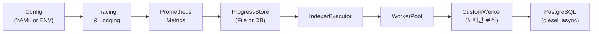

# Sui 서비스 특화 인덱서 코드 분석

이 문서는 Mysten Labs의 **DeepBook Indexer**, **Suins Indexer**, 그리고 **Indexer Builder** 크레이트의 핵심 모듈과 함수들을 살펴보며, 서비스용 커스텀 인덱서가 어떻게 동작하는지 코드 레벨에서 이해하는 데 목적을 둡니다.
각 컴포넌트가 어떻게 상호작용하며, 어떤 책임을 갖고 있는지 실제 소스코드를 통해 단계별로 탐구합니다.

---

# Sui 서비스 특화 인덱서 설계: Why & How

## Quickstart: 7단계로 커스텀 인덱서 만들기
1. 새 바이너리 크레이트 생성
```bash
cargo new --bin my-indexer
cd my-indexer
```
2. `Cargo.toml`에 공통 의존성 추가
```toml
[dependencies]
async-trait = "0.1"
tokio = { version = "1", features = ["full"] }
diesel_async = { version = "2", features = ["postgres"] }
serde = { version = "1", features = ["derive"] }
serde_yaml = "0.9"
telemetry-subscribers = { workspace = true }
mysten-metrics = { workspace = true }
sui-data-ingestion-core = { workspace = true }
sui-pg-db = { workspace = true }
```
3. `src/config.rs` 작성
```rust
use serde::{Deserialize, Serialize};
use std::env;
#[derive(Debug, Deserialize, Serialize)]
pub struct IndexerConfig {
    pub db_url: String,
    pub remote_store_url: String,
    #[serde(default = "default_concurrency")] pub concurrency: usize,
}
impl sui_config::Config for IndexerConfig {}
```
4. `src/main.rs` 작성
```rust
mod config; mod processor;
use telemetry_subscribers::TelemetryConfig;
use mysten_metrics::start_prometheus_server;
use sui_data_ingestion_core::{setup_single_workflow, ReaderOptions};
use sui_config::Config;
#[tokio::main]
async fn main() -> anyhow::Result<()> {
  TelemetryConfig::new().with_env().init();
  let cfg = IndexerConfig::load("config.yaml")?;
  let registry = start_prometheus_server("0.0.0.0:9090".parse()?).default_registry();
  let (exec, stop) = setup_single_workflow(
    processor::MyProcessor::new(&cfg).await?,
    cfg.remote_store_url.clone(),
    0, cfg.concurrency,
    Some(ReaderOptions{batch_size:100,..Default::default()}),
  ).await?;
  exec.await?; Ok(())
}
```
5. `src/processor.rs` 작성
```rust
use async_trait::async_trait;
use sui_data_ingestion_core::Worker;
use sui_types::full_checkpoint_content::CheckpointData;
pub struct MyProcessor;
#[async_trait]
impl Worker for MyProcessor {
  type Result = ();
  async fn process_checkpoint(&self, cp: &CheckpointData) -> anyhow::Result<()> {
    // 도메인 로직
    Ok(())
  }
}
```
6. Diesel 마이그레이션 생성 및 실행
```bash
diesel setup --database-url "$DB_URL"
diesel migration generate create_my_table
diesel migration run
diesel migration reset
diesel setup
diesel migration run
```
7. 실행 및 검증
```bash
cargo run --bin my-indexer
```   

---



이 글에서는 Mysten Labs가 Sui 생태계에서 운영 중인 **DeepBook Indexer**, **Suins Indexer**, 그리고 **Indexer Builder** 크레이트를 참고해, 서비스 특화 인덱서를 어떻게 설계하고 왜 이렇게 구성했는지 단계별로 살펴보겠습니다.

---

## 1. 배경 및 요구사항

1. 체인 데이터 스케일: Sui 네트워크의 트랜잭션·체크포인트 볼륨을 안정적으로 처리해야 합니다.
2. 실시간 스트리밍 & 백필: 과거 데이터(backfill)와 신규 이벤트(live) 모두 지원.
3. 확장성: 도메인별 비즈니스 로직 분리, 테스트·배포 편의.
4. 관찰성: 메트릭·로그·진척도를 통한 운영 모니터링.
5. 일관된 마이그레이션: 스키마 변경 시 자동화.

이 모든 요구를 만족하기 위해 **공통 인프라** 위에 **도메인별 워커**를 주입하는 구조를 선택했습니다.

---

## 2. 설계 원칙

- **단일 책임 원칙 (SRP)**: 설정, 로깅, 메트릭, 진척도, 인제스트, 처리, 저장을 개별 모듈로 분리
- **추상화 & 재사용**: `Worker`, `Datasource`, `Persistent` 트레이트로 재사용성 확보
- **비동기 파이프라인**: Tokio 기반 채널·스레드풀로 확장성 확보
- **Idempotency**: ProgressStore를 통한 체크포인트 매핑으로 재시작 가능
- **관찰성**: `telemetry-subscribers`, `prometheus` 통합으로 지표 수집

---

## 3. 공통 컴포넌트

### 3.1 Config 로드
serde_yaml + sui_config::Config 트레이트로 YAML 파일 혹은 ENV 로드 지원

```rust
// GitHub: https://github.com/MystenLabs/sui/blob/main/crates/sui-deepbook-indexer/src/config.rs#L1-L12
use serde::{Deserialize, Serialize};
use std::env;

#[derive(Debug, Clone, Deserialize, Serialize)]
pub struct IndexerConfig {
    pub remote_store_url: String,
    #[serde(default = "default_db_url")] pub db_url: String,
    // ... 기타 필드 생략
}

impl sui_config::Config for IndexerConfig {}

fn default_db_url() -> String {
    env::var("DB_URL").expect("DB_URL must be set")
}
```
### 3.2 트레이싱 & 로깅
telemetry-subscribers를 사용해 로깅 레이어 초기화

```rust
// GitHub: https://github.com/MystenLabs/sui/blob/main/crates/sui-deepbook-indexer/src/main.rs#L5-L10
use telemetry_subscribers::TelemetryConfig;

let telemetry = TelemetryConfig::new()
    .with_env_filter()   // RUST_LOG 같은 ENV 읽기
    .with_opentelemetry()// (선택) OTLP exporter
    .init();
tracing::info!("Telemetry initialized");
```
### 3.3 Metrics 서버
mysten_metrics::start_prometheus_server로 Prometheus metrics 서버 기동

```rust
// GitHub: https://github.com/MystenLabs/sui/blob/main/crates/sui-deepbook-indexer/src/main.rs#L12-L16
use mysten_metrics::start_prometheus_server;

let metrics_address =
    SocketAddr::new(IpAddr::V4(Ipv4Addr::new(0, 0, 0, 0)), config.metric_port);
let registry_service = start_prometheus_server(metrics_address);
let registry = registry_service.default_registry();
mysten_metrics::init_metrics(&registry);
tracing::info!("Metrics server started at port {}", config.metric_port);
```
### 3.4 ProgressStore
FileProgressStore로 로컬 파일 기반 진척도 저장

```rust
// GitHub: https://github.com/MystenLabs/sui/blob/main/crates/sui-data-ingestion-core/src/progress_store.rs#L1-L20
use sui_data_ingestion_core::FileProgressStore;

let progress_store = FileProgressStore::new(PathBuf::from(config.progress_file_path));
```
### 3.5 Ingestion Core
setup_single_workflow으로 체크포인트 파이프라인 구성

```rust
// GitHub: https://github.com/MystenLabs/sui/blob/main/crates/sui-data-ingestion-core/src/executor.rs#L56-L73
pub async fn setup_single_workflow<W: Worker + 'static>(
    progress_store: impl ProgressStore + Clone,
    concurrency: usize,
    metrics: DataIngestionMetrics,
) -> Result<(), anyhow::Error> {
    // ...
}
```
### 3.6 도메인 워커
async_trait 기반 도메인 워커 구현

```rust
// GitHub: https://github.com/MystenLabs/sui/blob/main/crates/suins-indexer/src/main.rs#L43-L66
#[async_trait]
impl Worker for SuinsIndexerWorker {
    type Result = ();
    async fn process_checkpoint(&self, checkpoint: &CheckpointData) -> Result<()> {
        // 도메인 로직
        Ok(())
    }
}
```
### 3.7 Persistence
diesel_async를 사용한 PostgreSQL 연결 풀 관리

```rust
// GitHub: https://github.com/MystenLabs/sui/blob/main/crates/sui-deepbook-indexer/src/postgres_manager.rs#L1-L18
use diesel_async::pooled_connection::bb8::{Pool, AsyncDieselConnectionManager};

pub fn get_connection_pool(db_url: String) -> Pool<AsyncDieselConnectionManager<AsyncPgConnection>> {
    // ...
}
```

---

## 4. 서비스별 특화 예시

### 4.1 DeepBook Indexer
IndexerBuilder를 사용해 백필 및 실시간 파이프라인 구성

```rust
// GitHub: https://github.com/MystenLabs/sui/blob/main/crates/sui-deepbook-indexer/src/main.rs#L91-L101
let indexer = IndexerBuilder::new(
    "SuiDeepBookIndexer",
    sui_checkpoint_datasource,
    SuiDeepBookDataMapper { /* ... */ },
    datastore,
)
.build();
indexer.start().await?;
```
### 4.2 Suins Indexer
IndexerExecutor와 WorkerPool을 통한 Suins 인덱싱
GitHub: https://github.com/MystenLabs/sui/blob/main/crates/suins-indexer/src/main.rs#L158-L166

```rust
//GitHub: https://github.com/MystenLabs/sui/blob/main/crates/suins-indexer/src/main.rs#L158-L166
let mut executor = IndexerExecutor::new(progress_store, 1, metrics);
let worker_pool = WorkerPool::new(
    SuinsIndexerWorker { /* ... */ },
    "suins_indexing".to_string(),
    100,
);
executor.register(worker_pool).await?;
executor.run(
    PathBuf::from(checkpoints_dir),
    remote_storage,
    vec![],
    ReaderOptions::default(),
    exit_receiver,
).await?;
```
### 4.3 Indexer Builder 크레이트
제네릭 Datasource, DataMapper, Persistent 인터페이스 제공

```rust
// GitHub: https://github.com/MystenLabs/sui/blob/main/crates/sui-indexer-builder/src/indexer_builder.rs#L10-L17
pub struct IndexerBuilder<D, M, P> {
    name: String,
    datasource: D,
    data_mapper: M,
    persistent: P,
    backfill_strategy: BackfillStrategy,
    disable_live_task: bool,
}

impl<D, M, P> IndexerBuilder<D, M, P> {
    pub fn new<R>(
        name: &str,
        datasource: D,
        data_mapper: M,
        persistent: P,
    ) -> IndexerBuilder<D, M, P>;
    // ...
}
```

---

## 5. 결론

위 패턴은 다음을 보장합니다:

1. **확장성**: 새로운 도메인 로직을 `Worker`로 간단 주입
2. **재사용성**: 공통 인프라(CLI·Logging·Metrics·Ingest) 분리
3. **운영 안정성**: ProgressStore·메트릭·Graceful Shutdown

Sui 서비스 특화 인덱서를 구축할 때, 이 구조를 그대로 재사용하면 빠르고 견고한 파이프라인을 만들 수 있습니다.
